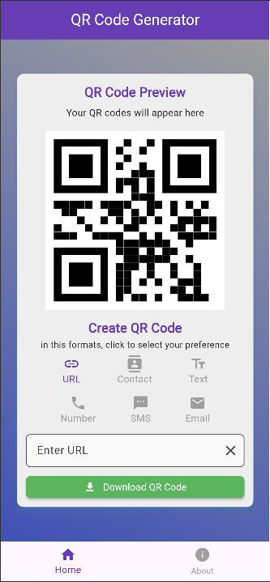
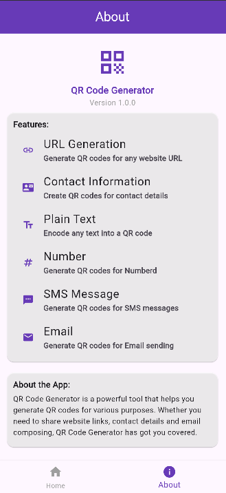

# QR Code Generator

A Flutter application that allows you to generate QR codes for various types of data, including URLs, contact information, text, numbers, SMS messages, and emails.

## Features

- **Multiple QR Code Types:** Generate QR codes for:
  - URLs
  - Contact Information (vCard)
  - Plain Text
  - Phone Numbers
  - SMS Messages
  - Emails (with subject and message)
- **Download QR Codes:** Save the generated QR codes to your device's gallery or download them on the web.
- **User-Friendly Interface:** A simple and intuitive interface for creating QR codes quickly and easily.
- **Cross-Platform:** Built with Flutter, this application works on Android, iOS, and the web.

## How to Use

1.  **Select QR Code Type:** Choose the type of QR code you want to generate from the icons at the top of the screen.
2.  **Enter Data:** Fill in the required fields for the selected QR code type.
3.  **Preview QR Code:** A preview of the QR code will be displayed on the screen.
4.  **Download:** Click the "Download QR Code" button to save the QR code to your device.

## Images

